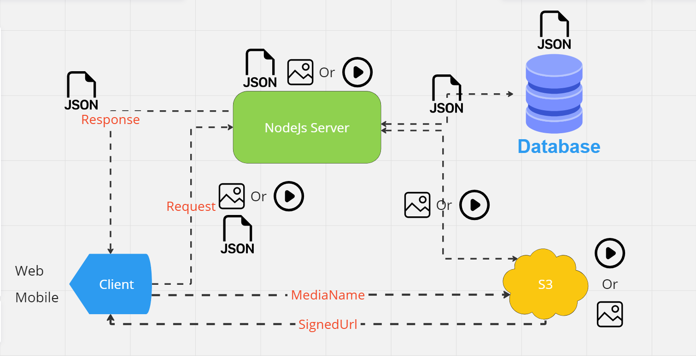
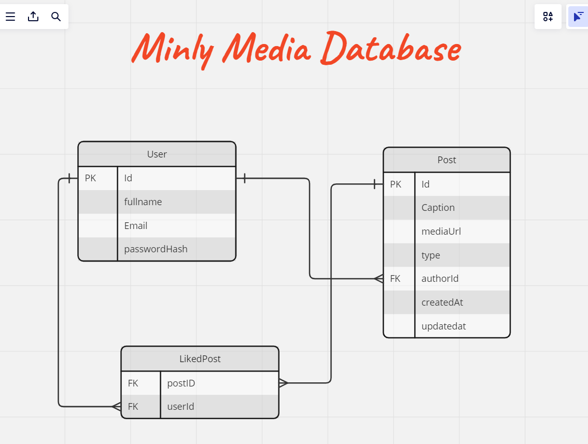

# minly-media-backend

The goal of this project is to create a backend server for sharing media platform API.

## 📚 Documentation

- [API Postman Documentation](https://documenter.getpostman.com/view/21757807/2sA3Bj7Djq)

## 📝 Live Preview

- [Live Preview](https://minly-media-backend.vercel.app/)

## 👨‍💻 System Design



## 🗄️ Database Structure



## 🧐 Features

| Feat                   | Authenticated User | Guest |
| :--------------------- | :----------------: | :---: |
| `Login - signup`       |         ❌         |  ✅   |
| `Viewing Latest posts` |         ✅         |  ✅   |
| `infinity scroll`      |         ✅         |  ✅   |
| `Create post`          |         ✅         |  ❌   |
| `ُEdit post`           |         ✅         |  ❌   |
| `Delete post`          |         ✅         |  ❌   |
| `Like / Dislike Post`  |         ✅         |  ❌   |

## 🌟 Project Eco System

- [NodeJs](https://nodejs.org)
- [ExpressJS](https://expressjs.com/)
- [TypeScript](https://www.typescriptlang.org/)
- [Prisma](https://www.prisma.io/)
- [@AWS-SDK/client-s3](https://www.npmjs.com/package/@aws-sdk/client-s3)
- [Multer](https://www.npmjs.com/package/multer)
- [Sharp](https://www.npmjs.com/package/sharp)
- [Zod](https://www.npmjs.com/package/zod)

## 🛠️ Installation

#### Clone Repository

```bash
  git clone https://github.com/hassan-kamel/minly-media-backend.git
```

### Rename `.env.example` to `.env` and try to set the following environment variables

```bash
PORT
DATABASE_UR

JWT_SECRET_KEY
JWT_EXPIRE_TIME

AWS_BUCKET_NAME
AWS_BUCKET_REGION
AWS_ACCESS_KEY
AWS_SECRET_ACCESS_KEY

```

#### Install Dependencies Using <strong>`npm`</strong> Make Sure You Have Installed <strong>`Node.js` </strong>

```bash
 npm install
```

#### Run Project

```bash
 npm run start
```

##### Or

```bash
 npx nodemon
```

#### Congrats 🎉

```bash
  http://localhost:8080/api/post?pageNumber=1&pageSize=10
```

## 🦢 API Reference

### Post Get Paginated

```http
GET /api/posts?pageNumber=${pageNumber}&pageSize=${pageSize}
```

| Parameter    | Type     | Description   |
| :----------- | :------- | :------------ |
| `pageNumber` | `Number` | **Required**. |
| `pageSize`   | `Number` | **Required**. |

### Get Single Post

```http
GET /api/post/${id}
```

| Parameter | Type     | Description                       |
| :-------- | :------- | :-------------------------------- |
| `id`      | `string` | **Required**. Id of Post to fetch |

### <p> Create Post </p>


```http
POST /api/post
```

| Parameter | Type              | Description   |
| :-------- | :---------------- | :------------ |
| `token`   | `string`          | **Required**. |
| `caption` | `string`          | **Required**. |
| `media`   | `binary` - `file` | **Required**. |

### <p> Update Post </p>


```http
PUT /api/post/${id}
```

| Parameter | Type     | Description   |
| :-------- | :------- | :------------ |
| `token`   | `string` | **Required**. |
| `id`      | `string` | **Required**. |
| `caption` | `string` | **Required**. |

### <p> Like Post </p>


```http
POST /api/post/like/${id}
```

| Parameter | Type     | Description   |
| :-------- | :------- | :------------ |
| `token`   | `string` | **Required**. |
| `id`      | `string` | **Required**. |

### <p> Dislike Post </p>


```http
POST /api/post/dislike/${id}
```

| Parameter | Type     | Description   |
| :-------- | :------- | :------------ |
| `token`   | `string` | **Required**. |
| `id`      | `string` | **Required**. |

### Signup

```http
POST /api/auth/signup
```

| Parameter  | Type     | Description   |
| :--------- | :------- | :------------ |
| `fullName` | `string` | **Required**. |
| `email`    | `string` | **Required**. |
| `password` | `string` | **Required**. |

### Login

```http
POST /api/auth/login
```

| Parameter  | Type     | Description   |
| :--------- | :------- | :------------ |
| `email`    | `string` | **Required**. |
| `password` | `string` | **Required**. |
